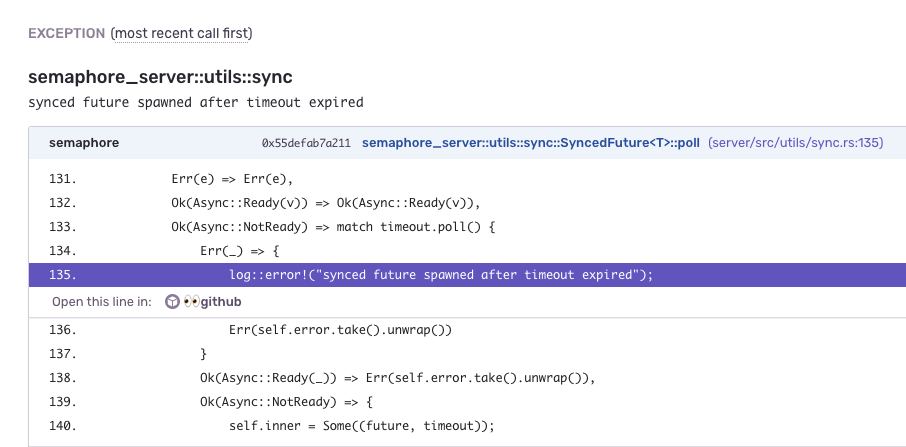

# sentry-app-github-internal
Internal Sentry App - Link sourcecode to GitHub

## Installation
In your organization settings, navigate to `Developer Settings` and add a new Internal Integration.

Set your `Webhook URL` to wherever you deployed this app, e.g. `https://sentry-app-github-internal.sentry.dev/`

Then for `Schema` add the following where `github` refers to the service, `getsentry` is our GitHub organization, and `sentry` is the repo

```json
{
  "elements": [
    {
      "type": "stacktrace-link",
      "uri": "/stacktrace/github/getsentry/sentry"
    }
  ]
}
```

## Example

